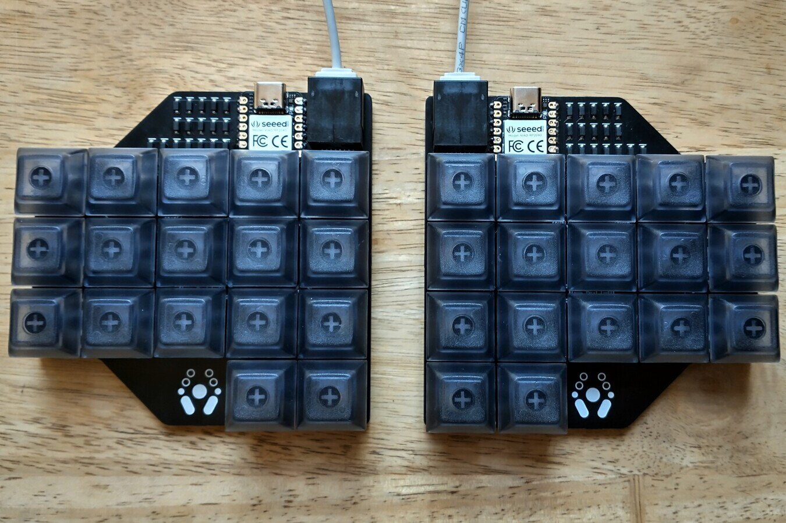
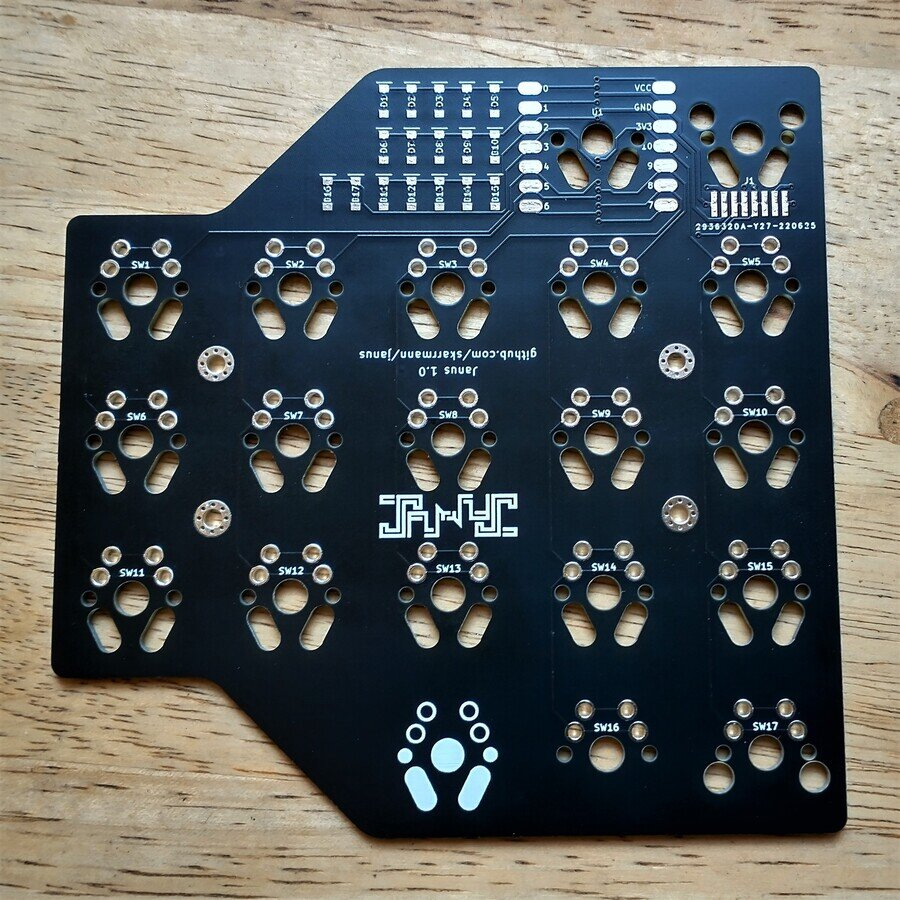
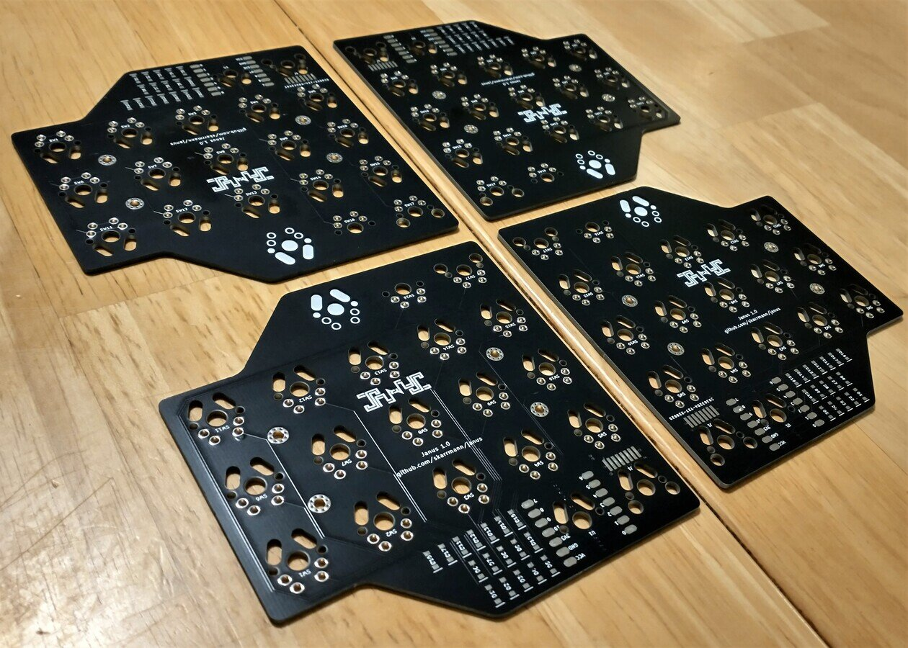
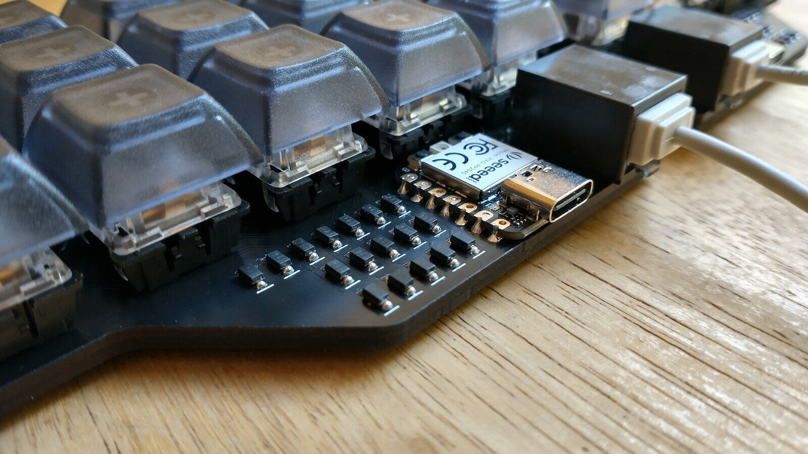
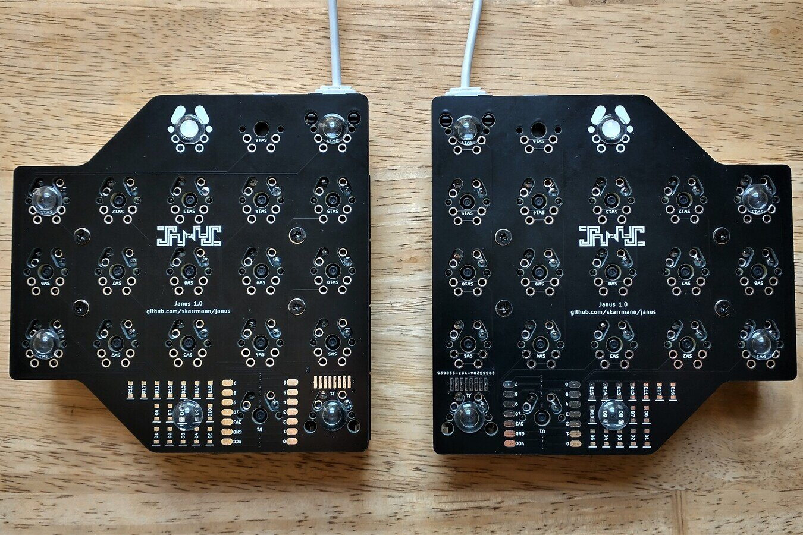
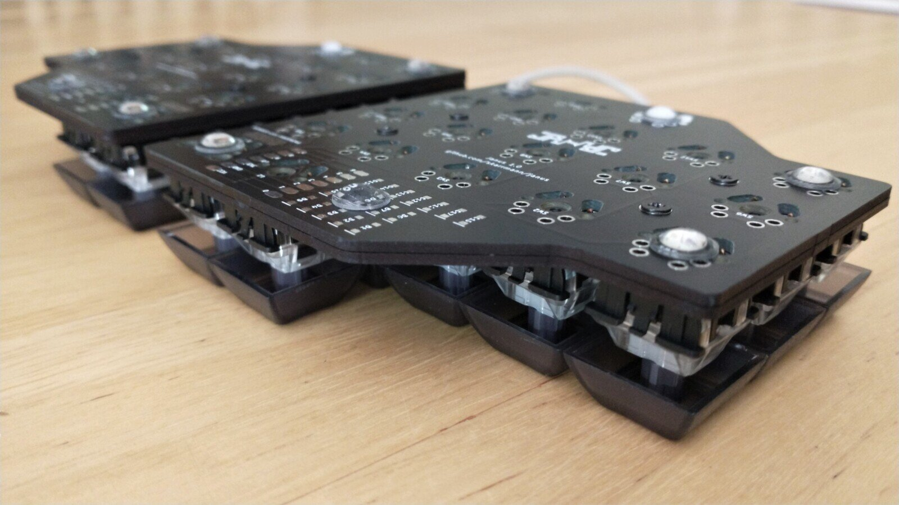
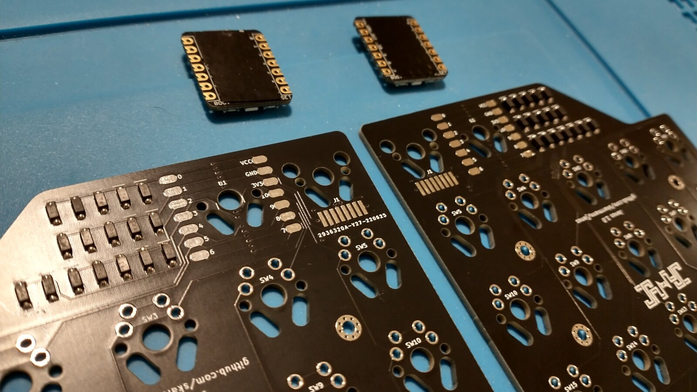
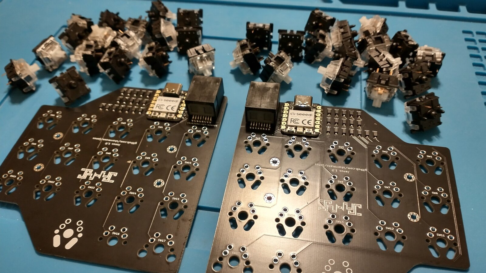

# Janus Keyboard

Janus is a small 34 key split ortholinear keyboard, powered by two Seeed XIAO RP2040 with the keyboards halves connected by an ethernet cable.

The PCB works as both a logical PCB and a bottom plate.

This keyboard is a grid of 1U keys with no special features: no hotswap, no RGB (except those on the XIAO RP2040), no OLED screen, no knobs. It only supports Cherry MX style switches.

## Project structure

* [`gerbers`](gerbers): Gerber files for PCB manufacturing
* [`graphics`](graphics): Source assets for PCB silkscreen
* [`kicad`](kicad): KiCad project files (schematics and PCB designs)
* [`kicad-libraries`](kicad-libraries): KiCad components and footprints
* [`images`](images): Images for project documentation
* [`firmware`](firmware): Firmware files

## PCBs

There is only one PCB design, and 4 copies of this PCB are used to assemble a single keyboard with bottom plates.

The PCB serves as both halves of the split keyboard, as well as bottom plates for those halves.

Flip the board horizontally to get the other keyboard half.

Both keyboard halves have surface-mount solder pads for diodes, microcontroller, and ethernet jack, all on the top side of the PCB.

The PCB is flipped vertically to serve as a bottom plate. The bottom plates are screwed directly to the logical PCB. Note the cutouts on the PCB line up with all the components' through-hole and plastic pins sticking out the bottom of the logical PCB.

The two halves of the keyboard communicate using full-duplex serial. Note the RX and TX connections are flipped on the top/bottom ethernet jack connections (TX connects to RX and vice-versa).

## Keyboard firmware

* KMK
    * Setup instructions and basic configuration is in this repo: [`firmware/kmk`](firmware/kmk)
* QMK
    * *TBD once RP2040 support is merged into QMK `master` branch*

## Bill of materials

Vendor URLs are just recommendations based on quality/affordablity. I have purchased from these vendors, but have no personal affiliation with them.

Part | Purpose | Quantity | Notes | Vendor URL
---- | ------- | -------- | --------- | ----------
PCB  | circuit board | 4 | | Send Gerber zip files to [JLCPCB](https://jlcpcb.com/).
Seeed XIAO RP2040 | Microcontroller board | 2 | | [Seeed Studio - XIAO RP2040](https://www.seeedstudio.com/XIAO-RP2040-v1-0-p-5026.html)
Kycon GMX-SMT2-N-88 | connect keyboard halves | 2 | | [DigiKey - GMX-SMT2-N-88](https://www.digikey.com/en/products/detail/kycon-inc/GMX-SMT2-N-88/10246865)
1N4148 SOD-123 | Diodes for keyboard row-column matrix | 34 | | [AliExpress (DSSRQI) - 1N4148 SOD-123](https://www.aliexpress.com/item/4000331408283.html)
Keyswitches |  | 34 | PCB mount (5 pin) switches recommended | MX: [AliExpress (KPrepublic) - Gateron Switch RGB 5pin Clear](https://www.aliexpress.com/item/3256801798608641.html)
Keycaps |  | 34 | | MX: [AliExpress (Cool Jazz) - DSA 1U Keycaps](https://www.aliexpress.com/item/2251832643863132.html)
M2 6mm screws | Secure main PCB and plate PCBs | 8 | | [AliExpress (wuhushiyu) - 200PCS-M2 Mix - Black](https://www.aliexpress.com/item/32862529967.html)
M2 nuts | Secure main PCB and plate PCBs | 8 | | See M2 set above
2mm tall rubber bumpons | Raise board above desk surface and provide skid resitance | 12 | Shop around - you can get cheaper alternatives if you don't need 96 of them! | [Amazon - 3M SJ5302 Clear Bumpon Blister Pack (96 Bumpons)](https://www.amazon.com/SJ5302-Clear-Bumpon-Blister-Bumpons/dp/B01ACPT2LU)

You will also need an ethernet patch cable to connect the keyboard halves. Monoprice Micro SlimRun cables are my personal recommendation.

## PCB manufacturing settings

These are the manufacturing settings I used when ordering from JLCPCB:

* **Base Material**: FR4
* **Layers**: 2
* **Dimensions**: (whatever the gerber file specifies)
* **PCB Qty**: 5
* **Different Design**: 1
* **Delivery Format**: Single PCB
* **PCB Thickness**: 1.6
* **PCB Color**: Black
* **Silkscreen**: White
* **Surface Finish**: LeadFree HASL-RoHS
* **Outer Copper Weight**: 1 oz
* **Gold Fingers**: No
* **Confirm Production File**: No
* **Flying Probe Test**: Fully Test
* **Castellated Holes**: No
* **Remove Order Number**: Specify a location

**IMPORTANT:** The PCBs has ["JLCJLCJLCJLC" silkscreen text](https://support.jlcpcb.com/article/28-how-to-remove-order-number-from-your-pcb) underneath the ethernet jack footprint. If you want to remove the order number from the boards or you want to print the PCBs with another manufacturer, then I recommend removing this silkscreen text from the `.kicad_pcb` file, and then regenerate the gerber files.

## Design decisions

The PCB design is in favor of PCB manufacturers' minimum order quantity of 5 and cheaper price at board sizes 100mm x 100mm. Since 4 PCBs are required to build the board with bottom plates, you are only left with one spare PCB.

The Seeed XIAO RP2040 was chosen as the microcontroller because its size works well with the intended layout. It just barely fits within the space of an MX keyswitch. The castellated pads permit surface-mount soldering, which makes the reversible PCB design more practical.

An ethernet connector was chosen to connect the keyboard halves because its connector fits within the space of an MX keyswitch. The Kycon GMX-SMT2-N-88 part was the best fit I could find for this use case. Although only 4 wires are needed for full-duplex serial communication between halves, an 8P8C ethernet jack was chosen over other modular jacks due to better part availability.

## Build tips

* Before starting, check if the PCBs are warped, and bend them to be perfectly flat before soldering.
* Solder the top SMD components first, in order of smallest to largest: diodes, XIAO RP2040, 8P8C ethernet jack
* Before soldering the XIAO RP2040, adhere a piece of electrical tape to its back to prevent potential shorts
    * 
* Use a piece of heat-resistant tape to align the XIAO RP2040 in place when soldering. Solder the opposing edge pads, and ensure the component is straight and flat.
    * 
* Solder the switches last!
    * 
* Attaching the bottom plates with M2 screws and nuts takes patience and a steady hand. If it's too annoying, use double-sided tape instead!

## KiCad project notes

Separate symbols and footprints are defined for the bottom plate cutouts (both for for MX switches and the 8P8C ethernet jack). No special code nor plugins are used here; these cutouts are manually positioned in the PCB design.

## Revision history

* **Janus 1.0** (2022-06-24)
    * Initial PCB design